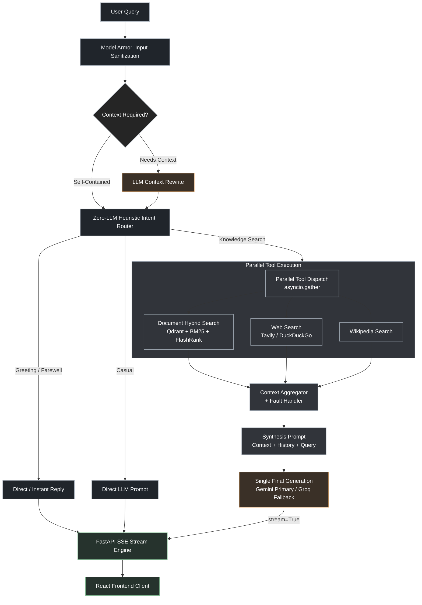

# Enterprise AI Platform with Agentic Retrieval

Production-oriented, full-stack Retrieval-Augmented Generation (RAG) platform with a FastAPI backend, React frontend, LangGraph orchestration, hybrid document retrieval, external search tools, streaming responses, and a modular knowledge-ingestion pipeline.

The platform is designed around a practical hybrid architecture: deterministic routing handles fast, predictable decisions while LLMs are used for contextual rewriting and grounded answer generation.

## At a glance

- **Backend:** FastAPI, Python 3.12, LangGraph, SSE streaming
- **Retrieval:** Qdrant dense search, BM25 sparse search, RRF fusion, FlashRank reranking
- **Models:** Gemini primary provider with Groq fallback through LiteLLM
- **Tools:** Local document search, web search, and Wikipedia search
- **Frontend:** React and Vite chat interface with citations and conversation history
- **Operations:** Docker, Cloud Run, Cloud Build, Model Armor, and LangSmith tracing

## Current architecture

The diagram is intentionally expressed as Mermaid so the architecture remains editable, responsive, and renderable in GitHub documentation. A downloadable SVG export is also available at [architecture-diagram-dark.svg](architecture-diagram-dark.svg).

The request lifecycle is:

1. The raw user message is checked by Google Cloud Model Armor when enabled.
2. Conversation history is restored for the active session.
3. The LangGraph context resolver decides whether contextual rewriting is necessary.
4. The heuristic router selects a direct response or one or more retrieval tools.
5. Selected tools execute concurrently and return evidence plus source metadata.
6. The graph aggregates valid results and generates a grounded response.
7. FastAPI streams progress, metadata, citations, metrics, tokens, and completion events to React using SSE.

The graph in [app/graph/](app/graph/) contains five executable nodes:

1. <code>context_resolver</code> — resolves follow-up questions when conversation context is required.
2. <code>router</code> — performs fast, zero-LLM intent and tool selection.
3. <code>parallel_retrieval</code> — runs selected tools with fault isolation.
4. <code>context_aggregator</code> — combines evidence and citation metadata.
5. <code>generate</code> — handles fast-path replies or streams the final LLM response.

The request boundary is implemented in [app/services/chat_service.py](app/services/chat_service.py), and the HTTP endpoint is [app/api/v1/chat.py](app/api/v1/chat.py).

## Query routing

The router is intentionally deterministic for low latency and predictable tool selection. It does not invoke all tools for every request.

| Query category | Typical signals | Selected path |
| --- | --- | --- |
| Greeting or farewell | <code>hello</code>, <code>hi</code>, <code>goodbye</code> | Immediate response |
| Casual conversation | <code>how are you</code>, <code>thanks</code>, <code>who are you</code> | Direct LLM prompt or fast response |
| Current information | <code>today</code>, <code>latest</code>, <code>news</code>, <code>weather</code>, <code>price</code> | Web search |
| Encyclopedic question | <code>who is</code>, <code>history</code>, <code>capital of</code> | Wikipedia and web search |
| Company or uploaded knowledge | <code>policy</code>, <code>PDF</code>, <code>manual</code>, <code>according to</code> | Document search |
| Ambiguous knowledge question | No strong specific signal | Document search and web search |

Leading greetings and courtesy phrases are removed before routing the substantive question. For example, <code>Hi, what is the return policy?</code> is routed to document search rather than being treated as a greeting.

## Retrieval architecture

Local document retrieval combines:

1. Dense semantic search against Qdrant using Gemini embeddings.
2. Sparse keyword search using BM25.
3. Reciprocal Rank Fusion in [app/retriever/hybrid.py](app/retriever/hybrid.py).
4. Optional FlashRank reranking.

Qdrant runs locally using the persistent [qdrant_data/](qdrant_data/) directory, or remotely through <code>QDRANT_URL</code> and <code>QDRANT_API_KEY</code>.

## Project structure

~~~text
app/
  agents/          Intent routing
  api/v1/          FastAPI endpoints
  context/         Conversation history and query rewriting
  graph/           LangGraph state, nodes, and builder
  guardrails/      Google Cloud Model Armor input scanning
  llm/             LLM gateway and provider fallback
  retriever/       Dense, sparse, and hybrid retrieval
  reranker/        FlashRank and no-op rerankers
  services/        Chat orchestration and SSE streaming
  tools/           Document, web, and Wikipedia tools
ingestion_platform/
  connectors/      PDF and text connectors
  stages/          Cleaning, chunking, embedding, and indexing
  core/            Pipeline and shared models
frontend/          React/Vite chat interface
data/              Example source documents
eval/              Benchmark and evaluation scripts
tests/             Unit and integration tests
deploy/            GCP deployment scripts and guide
~~~

## Technology stack

| Area | Technology |
| --- | --- |
| Backend | Python 3.12, FastAPI, Uvicorn, Pydantic Settings |
| Orchestration | LangGraph, asyncio |
| LLM gateway | LiteLLM SDK with Gemini primary and Groq fallback |
| Embeddings | Google Gemini embeddings |
| Vector search | Qdrant |
| Sparse search | Rank-BM25 |
| Reranking | FlashRank |
| External search | Tavily or DuckDuckGo, Wikipedia |
| Frontend | React, Vite, React Markdown, Lucide React |
| Deployment | Docker Compose, Google Cloud Run, Cloud Build |

## Configuration

Create a <code>.env</code> file in the repository root. A minimal configuration is:

~~~env
GOOGLE_API_KEY=your_gemini_key
GROQ_API_KEY=your_groq_key

LLM_MODEL=gemini/gemini-3.1-flash-lite
FALLBACK_LLM_MODEL=groq/llama-3.3-70b-versatile
EMBEDDING_MODEL=models/gemini-embedding-001

QDRANT_COLLECTION_NAME=agentic_rag_documents
# Leave QDRANT_URL empty for local persistent storage.
QDRANT_URL=
QDRANT_API_KEY=

TAVILY_API_KEY=
USE_HYBRID_SEARCH=true
USE_RERANKER=true
RETRIEVAL_TOP_K=15
RERANKED_TOP_K=5

ENVIRONMENT=development
DEBUG=false
LOG_LEVEL=INFO
~~~

Optional integrations include LangSmith tracing, Google Cloud Speech-to-Text, and Google Cloud Model Armor. See [app/core/config.py](app/core/config.py) for all settings.

<code>DEBUG</code> must be a boolean such as <code>true</code> or <code>false</code>; values such as <code>release</code> are invalid for the current Pydantic settings model.

## Run locally

### Backend

~~~powershell
python -m venv .venv
.\.venv\Scripts\Activate.ps1
pip install -r requirements.txt
python -m uvicorn app.main:app --reload --port 8000
~~~

The backend runs at <code>http://localhost:8000</code>; Swagger UI is at <code>http://localhost:8000/docs</code>.

### Frontend

~~~powershell
cd frontend
npm install
npm run dev
~~~

The Vite development server normally runs at <code>http://localhost:5173</code>.

### Docker Compose

~~~bash
docker compose up --build
~~~

Check [docker-compose.yml](docker-compose.yml) for service ports and environment variables.

## Document ingestion

The independent ingestion platform processes PDF and text files through:

~~~text
Connectors -> cleaning -> chunking -> Gemini embeddings -> Qdrant indexing
~~~

Run ingestion with:

~~~bash
python ingest.py --source ./data
python ingest.py --source ./data --reindex
python -m ingestion_platform.cli ./data
~~~

The sample documents are in [data/](data/). The indexer uses deterministic point IDs, making repeated ingestion idempotent for unchanged chunks.

## API endpoints

- <code>POST /api/v1/chat/stream</code> — SSE stream containing progress, tokens, metadata, citations, metrics, and completion events.
- <code>GET /api/v1/health</code> — health endpoint.
- <code>GET /api/v1/health/live</code> — liveness probe.
- <code>GET /api/v1/health/ready</code> — readiness probe.
- <code>POST /api/v1/voice/transcribe</code> — optional speech-to-text integration.
- <code>GET /api/v1/eval/metrics</code> — latest evaluation report and samples.

Request and response schemas are defined in [app/schemas/chat.py](app/schemas/chat.py). Use <code>/docs</code> for the live OpenAPI contract.

## Testing and evaluation

Run tests from the project virtual environment:

~~~powershell
.\.venv\Scripts\python.exe -m pytest -q
~~~

The suite covers routing, the LangGraph pipeline, backend behavior, SSE streaming, guardrails, and evaluation metrics.

Run evaluation scripts with:

~~~bash
python eval/evaluate.py
python eval/evaluate_ragas.py
~~~

Evaluation supports an empirical lexical benchmark and can write results to [eval/ragas_report.json](eval/ragas_report.json). Results depend on configured providers, indexed documents, network access, and API keys.

## Guardrails and observability

When Model Armor is enabled, the raw latest user message is scanned before session restoration, query rewriting, routing, retrieval, or LLM execution. Blocked or unavailable scans are returned as explicit SSE events. Retrieved content is treated as untrusted evidence, not as executable instructions.

Enable LangSmith tracing with:

~~~env
LANGSMITH_TRACING=true
LANGSMITH_API_KEY=your_langsmith_key
LANGSMITH_PROJECT=Agentic RAG
~~~

## Deployment

The repository includes:

- [Dockerfile](Dockerfile) for the backend container.
- [frontend/Dockerfile](frontend/Dockerfile) for the frontend build.
- [docker-compose.yml](docker-compose.yml) for local multi-service execution.
- [cloudbuild.yaml](cloudbuild.yaml) for Google Cloud Build.
- [deploy/deploy-gcp.ps1](deploy/deploy-gcp.ps1) and [deploy/deploy-gcp.sh](deploy/deploy-gcp.sh) for Cloud Run deployment.
- [deploy/GCP_DEPLOYMENT.md](deploy/GCP_DEPLOYMENT.md) for deployment instructions.

For production, provide provider credentials and Qdrant settings through secret management rather than committing them to <code>.env</code> or source control.

## Development notes

- External search tools can fail independently; the graph continues with successful retrieval results.
- The frontend stores conversation history locally and sends it to the stateless backend when needed.
- Provider names, model defaults, retrieval settings, and feature flags are controlled by [app/core/config.py](app/core/config.py).
- The current router is heuristic-based; ambiguous cases should be monitored and improved using evaluation data.
